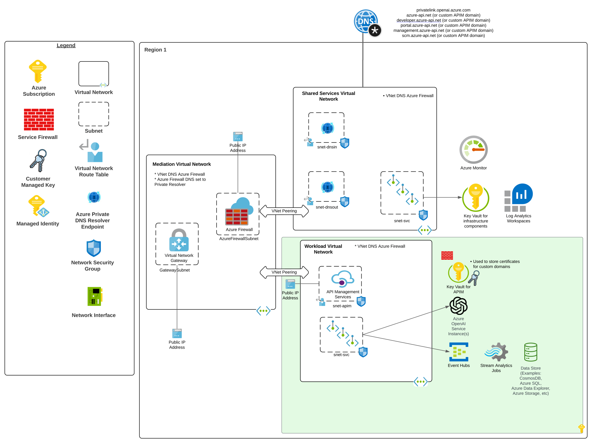
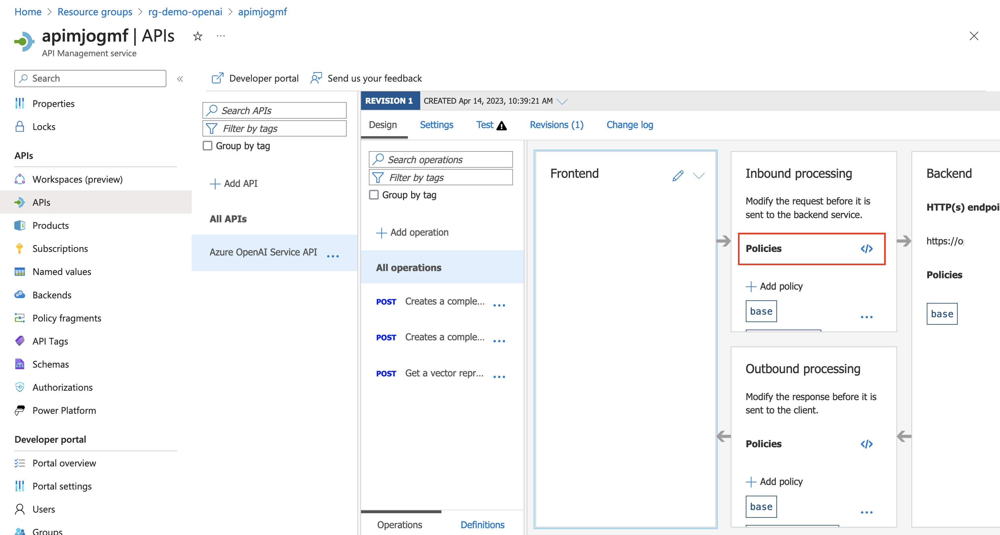

# Enterprise Azure OpenAI Advanced Logging

Repository detailing an advanced logging pattern for the Azure OpenAI Service.

## Key Solution Advantages:
*	<b>Supports models with larger token sizes</b> The advanced logging pattern supports [capturing an event up to 200KB](https://learn.microsoft.com/en-us/azure/api-management/api-management-howto-log-event-hubs?tabs=PowerShell) while the [basic logging pattern](../README.md) supports a [maximum size of 8,192 bytes](https://learn.microsoft.com/en-us/azure/api-management/api-management-howto-app-insights). This allows the pattern to support capturing prompts and responses from models that support [larger token sizes such as GPT4](https://learn.microsoft.com/en-us/azure/cognitive-services/openai/concepts/models#gpt-4-models-1).

*	<b>Enforce strong identity controls and audit logging</b> Authentication to the Azure OpenAI Service resource is restricted to Azure Active Directory identities such as service principals and managed identities. This is accomplished through the usage of an [Azure API Management custom policy](https://learn.microsoft.com/en-us/azure/api-management/validate-jwt-policy). The identity of the application making the request is captured in the logs streamed to the Azure Event Hub.

*	<b>Log the information important to you</b> [Azure API Management custom policies](https://learn.microsoft.com/en-us/azure/api-management/log-to-eventhub-policy) can be used to filter the information captured in the event to what is important to your organization. This can include prompts and responses, the number of tokens used, the Azure Active Directory identity making the call, or the model response time. This information can be used for both compliance and chargeback purposes.

*	<b>Deliver events to a wide variety of data stores</b> Events in this pattern are streamed to an [Azure Event Hub](https://learn.microsoft.com/en-us/azure/event-hubs/event-hubs-about). These events can be [further processed by the integration with Azure Stream Analytics](https://learn.microsoft.com/en-us/azure/event-hubs/process-data-azure-stream-analytics) and then delivered to data stores such as Azure SQL, Azure CosmosDB, or a PowerBI Dataset.

## Reference Architecture

## Request Flow

## Features

This project framework provides the following features:

* Enterprise logging of OpenAI usage metrics:
   * Prompt Input
   * Prompt Response
   * Token Usage
   * Model Usage   
   * Application Usage
   * Model Response Times

* High Availability of OpenAI service with region failover.

* Integration with latest OpenAI libraries-
  *  [OpenAI](https://github.com/openai/openai-python/) 
  *  [LangChain](https://python.langchain.com/en/latest/)
  *  [Llama-index](https://gpt-index.readthedocs.io/en/latest/)

## Getting Started

### Prerequisites
- [Azure Subscription](https://azure.microsoft.com/en-us/get-started/)
- [Azure OpenAI Application](https://aka.ms/oai/access) 
  
### Installation
Provisioning artifacts, begin by provisioning the solution artifacts listed below:

-	[Azure OpenAI Cognitive Service]( https://azure.microsoft.com/en-us/products/cognitive-services/openai-service/)
-	[Azure API Management](https://azure.microsoft.com/services/api-management/)
-	[Azure Monitor](https://azure.microsoft.com/services/monitor/)

(Optional)
- Next-Gen Firewall Appliance
-	[Azure Virtual Network](https://azure.microsoft.com/services/virtual-network/)

### Managed Services
-	[Azure Key Vault](https://azure.microsoft.com/services/key-vault/)
-	[Azure Storage](https://azure.microsoft.com/services/storage/)
-	[Azure Active Directory](https://azure.microsoft.com/services/active-directory/)

## Deployment

### Azure OpenAI
- To begin, provision a resource for Azure OpenAI in your preferred region.  <b>Please note the current primary region is East US</b>, new models and capacity will be provisioned in this location before others: [Provision resource](https://portal.azure.com/?microsoft_azure_marketplace_ItemHideKey=microsoft_openai_tip#create/Microsoft.CognitiveServicesOpenAI)

- Once the resource is provisioned, create a deployment with model of choice: [Deploy Model](https://learn.microsoft.com/en-us/azure/cognitive-services/openai/how-to/create-resource?pivots=web-portal#deploy-a-model)

- After the model has been deployed, go to the OpenAI studio to test your newly created model with the studio playground: [oai.azure.com/portal](oai.azure.com/portal)

### API Management Deployment
1. API Management can be provisioned through Azure Portal using the instructions at this [link](https://learn.microsoft.com/en-us/azure/api-management/get-started-create-service-instance). 

2. Once the API Management service has been provisioned you must import your OpenAI API layer using the OpenAPI specification for the service.

### [API Import Instructions](https://learn.microsoft.com/en-us/azure/api-management/import-and-publish#go-to-your-api-management-instance)

1. Open the APIM - API blade and Select the Import option for an existing API.  
  

2. Select the Update option to update the API to the current OpenAI specifications.  The Completions OpenAPI specification is found at https://raw.githubusercontent.com/Azure/azure-rest-api-specs/main/specification/cognitiveservices/data-plane/AzureOpenAI/inference/stable/2023-05-15/inference.json.

3. Test the endpoint to validate the API Management instance resource can communicate with the Azure OpenAI Service resource. Provide the "deployment-id", "api-version" and a sample prompt as seen in the screenshot below. The deployment-id is the name of the model deployment you created in the Azure OpenAI Service resource.

### **Event Log Deployment**

1. You must deploy an Event Hub Namespace resource and Event Hub. This [can be done in the Azure Portal](https://learn.microsoft.com/en-us/azure/event-hubs/event-hubs-create).

2. Record the information listed below. It will be required when creating the API Management Logger.

    * Event Hub Namespace FQDN. Example mynamespace.servicebus.windows.net

    * Event Hub Name. This is the name of the Event Hub you created within the Event Hub Namespace.

    * Resource Id of the Event Hub Namespace.

### **User-assigned Managed Identity**

1. It is recommended to use a user-assigned managed identity to authenticate the API Management resource to the Event Hub. You can create the User-assigned Managed Identity in the [Azure Portal using these instructions](https://learn.microsoft.com/en-us/azure/active-directory/managed-identities-azure-resources/how-manage-user-assigned-managed-identities?pivots=identity-mi-methods-azp).

2. Record the client id of the user-assigned managed identity. It will be required when creating the API Management Logger.

### **Assign permissions to the Event Hub to the User-Assigned Managed Identity**

1. Assign the user-assigned managed identity you created in the earlier step to the [Azure Event Hubs Data Sender Azure RBAC role](https://learn.microsoft.com/en-us/azure/api-management/api-management-howto-log-event-hubs?tabs=PowerShell#option-2-configure-api-management-managed-identity).

2. You can assign the role using the [Azure Portal using these instructions](https://learn.microsoft.com/en-us/azure/role-based-access-control/role-assignments-portal).

3. Wait at least 15 minutes for the role to propagate throughout Azure. If you do not wait at least 15 minutes, you may encounter an error when creating the API Management Logger.

### **Add the User-Assigned Managed Identity to the Azure API Management Resource**

1. You must add the user-assigned managed identity you created to the API Management resource. You can do this through the [Azure Portal using these instructions](https://learn.microsoft.com/en-us/azure/api-management/api-management-howto-use-managed-service-identity#create-a-user-assigned-managed-identity).

### **Create the API Management Logger**

1. The API Management Logger can only be created through CLI or an ARM template. A [sample ARM template](../assets/apim-logger.json) is provided in this repository. You can [deploy the ARM template using the Azure Portal using these instructions](https://learn.microsoft.com/en-us/azure/azure-resource-manager/templates/deploy-portal). You must provide the relevant information collected in the previous step. Take care to provide the exact information detailed in the ARM template. If you do not provide the exact information you will encounter non-descriptive errors.

2. Record the name that you assign to the logger. This will be required in the next step.

### **Create the custom API Management Policy**

1. In <b>Design</b>section of the API in the API Management resource select the <b></></b> link in the Inbound policies section as seen in the screenshot below. 

2. Copy and paste the custom Azure API Management Policy [provided in this repository](../assets/apim-policy-event-hub-logging.xml). You must modify the variables in the comment section of the policy with the values that match your implementation. The policy will create two events, one for the request and one for the response. The events are correlated with the message-id property which a unique GUID generated for each message to the API.

3. When complete click Save to commit the policy. If you receive any errors, likely you missed a variable or added a character.

### **Test the configuration**

Test the configuration to ensure it is working as intended. Recall that the API Management policy restricts to Azure Active Directory identities so you must pass an valid access token to API Management instance. The context of the identity (such as a service principal) included in the access token must have appropriate Azure RBAC permissions on the Azure OpenAI Service resource. 

Sample code in Python using a service principal can be found at this link https://github.com/mattfeltonma/demo-openai-python. You should provide the API Management FQDN for the API as the OPENAI_BASE variable.

If you receive errors double-check that the service principal has the appropriate permissions on the Azure OpenAI Service resource.

You can also test that messages are being received from the Azure Event Hub using the [Azure Event Hub Explorer Visual Studio Code Add-In](https://marketplace.visualstudio.com/items?itemName=Summer.azure-event-hub-explorer).

### **Analyzing Event Hub Messages**

After you have verified requests and responses are being captured by the Azure Event Hub, you can capture those events in a number of ways. The integration with Azure Stream Analytics provides a number of simple ways to extract, transform, and load events from an Azure Event Hub to a data store for further analytics. 

[Review the documentation](https://learn.microsoft.com/en-us/azure/event-hubs/process-data-azure-stream-analytics) and select the option that works best for your organization.

